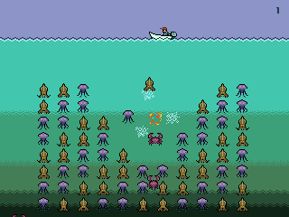

Mako
====

Mako is a portable stack-based virtual game console. Mako was designed to be simple to port and implement: even including optional features, the reference implementation is only a few pages of Java. All the games and demos written for Mako can now be tried directly in your browser thanks to [Mako.JS](http://johnearnest.github.io/Mako.js/).

The Mako platform includes a complete development toolchain centered around [Maker](docs/makoBasics.md), a Forth-like systems programming language. Maker comes with an extensive [standard library](lib/), including such highlights as a modular [garbage collector](lib/Algorithms/Garbage.fs), a [cooperative multitasking system](lib/Algorithms/Threads.fs), an [entity management system](lib/Game/Entities.fs), and [audio synthesis utilities](lib/Game/Blip.fs). Where applicable, libraries have [test harnesses](lib/Test) based on the [Test Anything Protocol](https://testanything.org).

Other programming tools targeting the Mako VM include [FiveTran](tools/Fivetran/), a historically-inspired FORTRAN compiler, and [Stroyent](tools/Stroyent/), a C-like systems language. Other programming environments run directly on the Mako VM, like [MASICA](demos/Masica/), a TinyBASIC, [Loko](demos/Loko), a powerful Logo environment, and [MakoForth](demos/Forth/), a proper Forth which powers the game [Forth Warrior](games/Warrior2/).

Most work on Mako ceased in 2013, but the repository here is maintained for inspiration and educational purposes.

Using _Maker_
-------------
Mako's toolchain requires Java and Apache Ant. The Maker source files provided in the examples directory can be executed by compiling Maker and then invoking it with a filename and the '--run' flag. Without the flag, Maker will simply print a disassembly of the prepared Mako memory image.

To compile, run `ant` from the top directory.

To run an example, invoke Maker from the command line:

	java -jar dist/Maker.jar /games/Pong/Pong.fs --run

Or use the 'maker' script to save a little typing:

	./maker /games/Pong/Pong.fs --run

Hardware Overview
-----------------
- All registers are memory-mapped, simplifying save-states and metaprogramming.
- Dual-stack architecture (parameter stack and return stack).
- 32-bit word-oriented memory.
- 320x240 pixel 24-bit display at 60hz.
- 256 variable-sized sprites with flags for mirroring.
- Scrollable 31x41 grid of 8x8 background tiles, with draw-priority flags.
- Keyboard and "virtual gamepad" input.
- 8khz sampled audio output.
- Memory-mapped RNG.
- Optional console and filesystem I/O.
